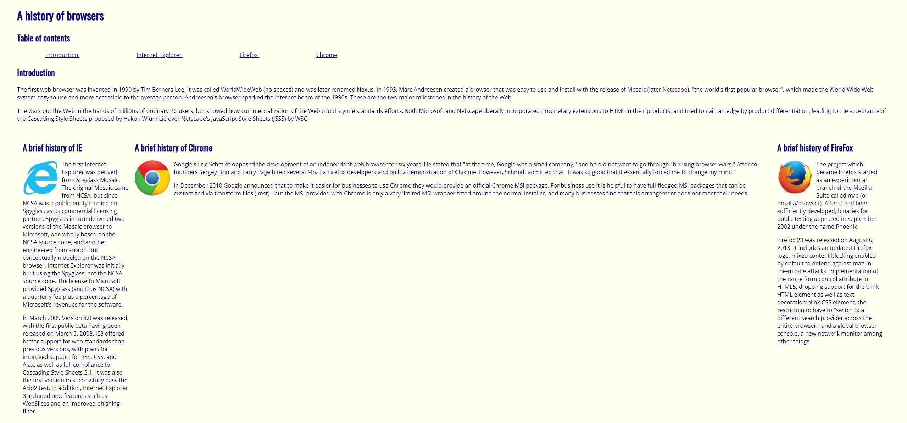
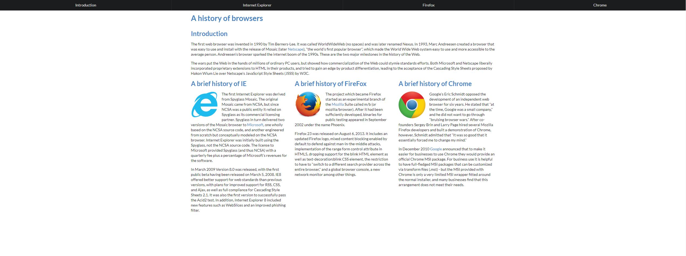

  When I was introduced to HTML and CSS from code.org in high school, I thought that creating an appealing website was difficult because it takes too much work in CSS just to style an element. At that time, I was only able to create a simple website with normal preset fonts and solid boring colors from the basic HTML code I was introduced to. With the introduction of Semantic UI, my first impression was that it’s an amazing tool that I wished I knew back in high school. It makes life so much easier whenever I need to make an element like a button or an icon when Semantic UI auto-does it for me. I don’t have to worry about the background color or the size of the element, all I need to do is search up a keyword in the class, and Semantic UI takes care of the rest. However, as I learn more about Semantic UI, I realized that this is much more complicated than what meets the eye. It’s an in-depth tool that can sometimes be confusing and frustrating to use. After spending much more time with Semantic UI, I still hold the opinion that the benefits of Semantic UI outweigh the frustrations it causes.  

## Why UI Framework
  Semantic UI is just one of many UI Frameworks. There are many more UI Frameworks that are available to use. A UI Framework is a library with a set of classes and interfaces that helps you create certain elements when you make a website. Although using the UI Framework is extremely helpful and helps you make beautiful websites easier, it still takes time and effort to learn how to properly use it. It can be challenging in the beginning; I was overwhelmed with the amount of features Semantic UI has in store for me: icons, loaders, menus, dropdowns, and many more. Even with the investment needed for UI Framework, I think that using a UI Framework is still miles better than using only raw HTML and CSS to code a website. Using a UI Framework is more efficient because you only need to type out the syntax instead of spamming pages of code in CSS just to make a dropdown menu. On a large-scale website, I can’t imagine how much time you would take to design each component of the website if you are only using raw HTML and CSS. It would be a painful experience that I am sure no one enjoys. 

<h3>Using raw HTML and CSS</h3>

<h3>Using Semantic UI</h3>

## To Conclude
  Now that I have more experience with Semantic UI, I am starting to get used to it and we are able to make better websites with this new tool. Raw HTML and CSS code are primitive when compared to the much more modern and sophisticated Semantic UI. I cannot see myself in the future ever using raw HTML and CSS again now that I am exposed to UI Frameworks. I am looking forward to learning more about UI Frameworks and finding the one I am most comfortable with.
