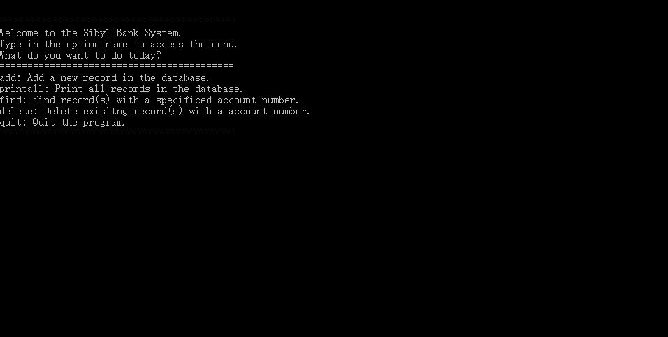
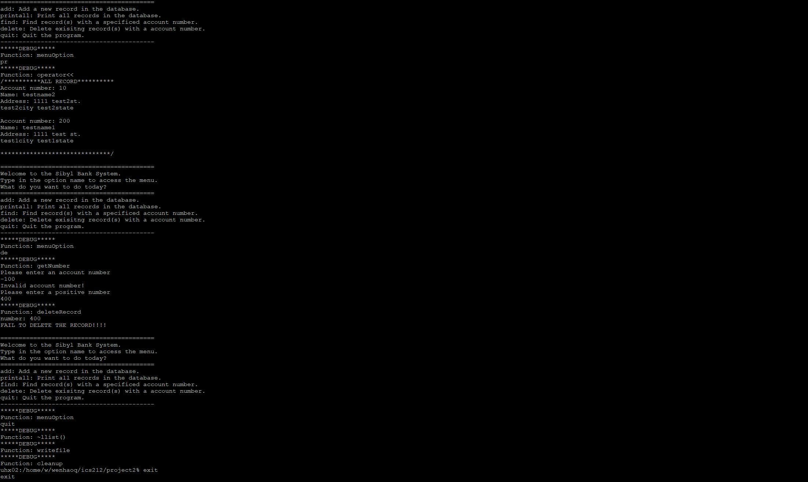
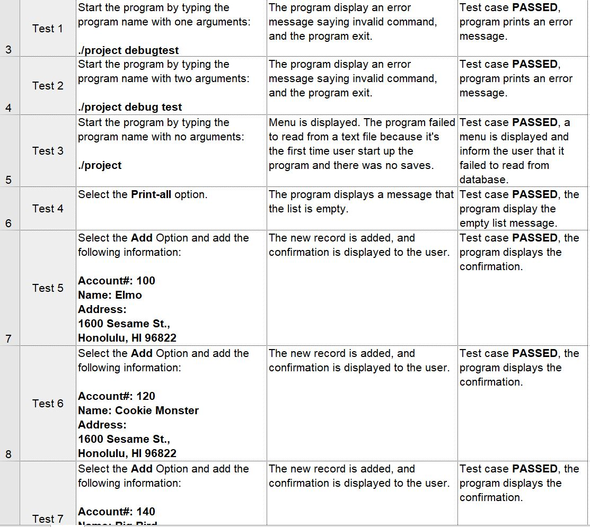

  
   

 
This project is a bank database program that I made for ICS 212. This project is a continuation of a C project that I code previously. The previous project was solely coded in C, while this project is the combination of C and C++. This program allows the user to interact with the program by typing the choices in the console. The program can add bank account records, print a list of records, find a specific record, delete a specific record, load the list of records at the beginning of the program from a text file, and save the list of records to a text file when the user exit the program.  One option I wished I can add to this program is the ability to edit a record in the list. Currently, if the user wishes to edit a record in the list, they first have to delete the program and then add a new record. The program stores the runtime list of records by using the computer's heap memory. The heap memory is very different from stack memory because it's dynamic. It allows the user to allocate space at any time. 

 Using the heap memory also created many challenges for me because I have to be more careful with pointers and memory. To overcome these challenges, I had to plan out how each function and class in the program will interact with each other and avoid running into any problems. I also created a test plan so that I can make sure everything in the program is functional. This project really gave me a new perspective on programming since I was never exposed to pointers and addresses in my classes before. This long project has taught me how to code in C++, how to use pointers, how memory allocation works in C++, reference and polymorphism. After completing this project, I finally understand how the computer creates variables and assigning definitions to a variable.

This project can be found <a href="https://github.com/wenhaoq20/bank-system">here</a>
