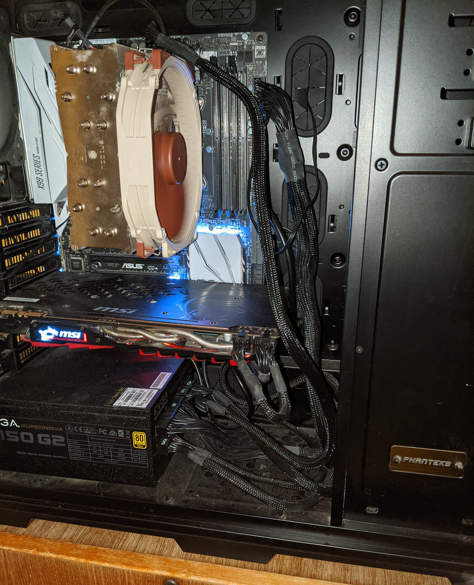
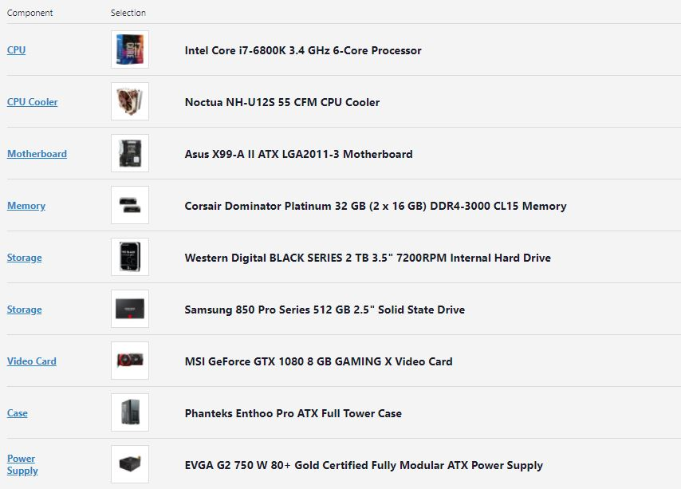
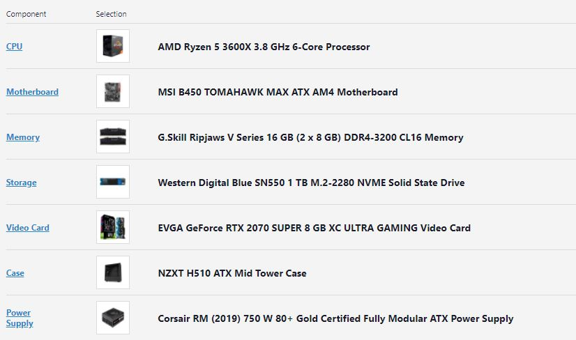

  
  

Normally, when people hear the phrase, “build your own computer,” their first impression is that it is a very daunting and scary task, but in reality, building a computer is actually more simple than what people might think. Building a desktop is like constructing a lego set for me. The only difference is that there are screws involved in building a computer.  I built my own computer when I was a freshman in high school. I prepared by watching many tutorials on how to build a computer and what to watch out for. When I was done building my computer and the monitor lights up, I was very proud of it because it’s something that I created by myself. Building computers has taught me how to research, how to be patient, and how to problem-solve. These skills I quickly put into practice when I built my friend’s computer and analyzed the various elements, whether it was properly plugged in, and solved problems as they came up. Building my own computer was a life-changing experience for me.

Here is the pc part list:
 
  <ol>
    <li> test <li>
  </ol>

