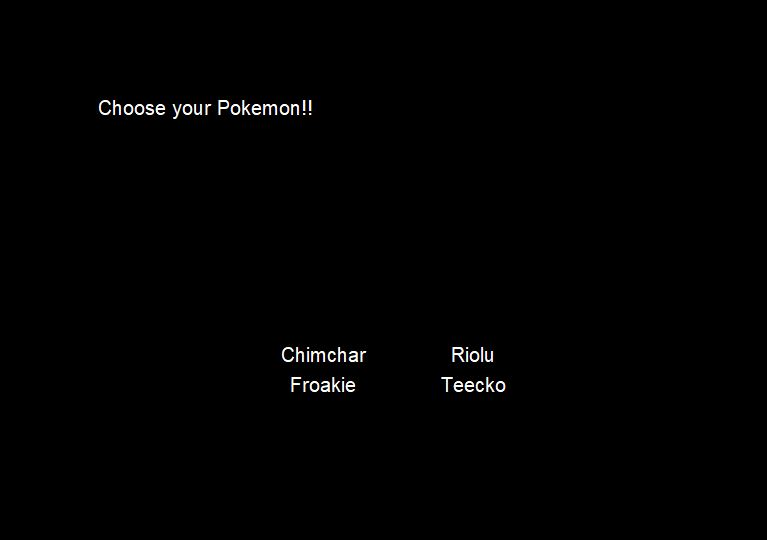
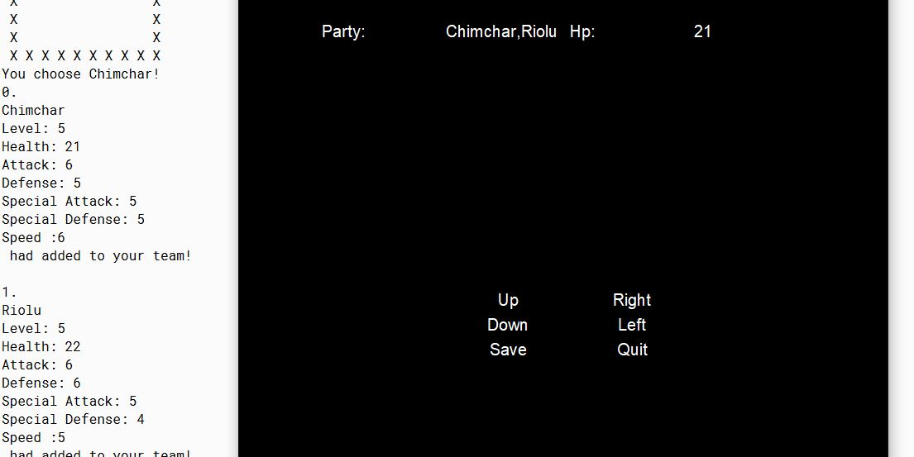
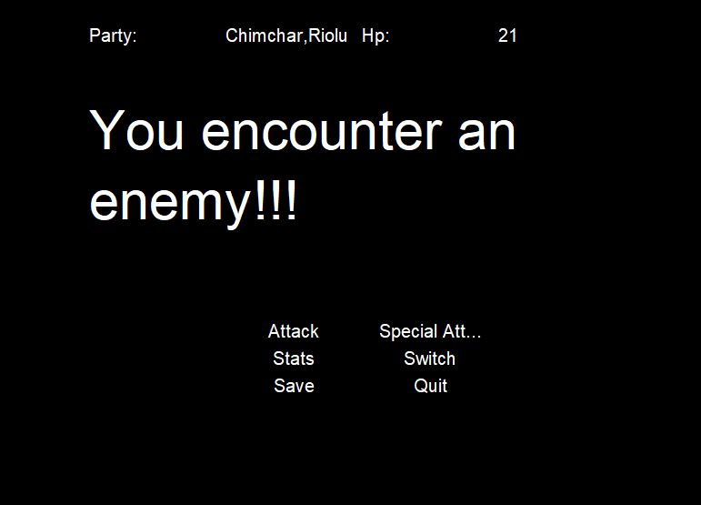
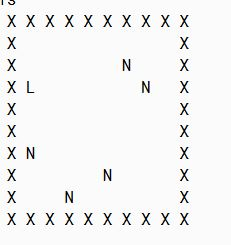

  
  
  

Pokemon Maybe is an attempt from me to try to recreate the famous game Pokemon for my AP computer science class back in high school. I worked on this game alone and it took me a couple of months to get to this stage. This game is a text-based adventure game with a map that contained different enemies at random locations for the user to eliminate. 
 
 The game is not fully complete and misses a couple of functions like music playing in the background. Currently, the user can pick which pokemon they want to start with first. Each Pokemon have different properties like their type, moves, and stats. The user can go around the map and choose to fight all of the enemies. As the user defeats each enemy, the pokemon will level up along with their stats making them stronger. The game also has a save and load function where the user can save their current progress and keep it for next time. The user can either choose to type out the command or use the GUI to play the game. 
 
This was the first major project I coded in Java and there are many things to take away from this project. In this project, I learned many things about java especially a lot about classes (abstract classes, class hierarchy), and different java libraries like JFrame, JButton, JLabel, JPanel, JTextArea, Color, and other numerous Java libraries.

This project can be found <a href="https://github.com/wenhaoq20/pokemon-clone">here</a>

