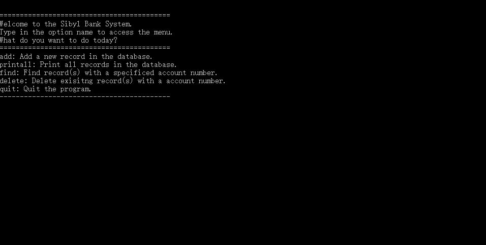
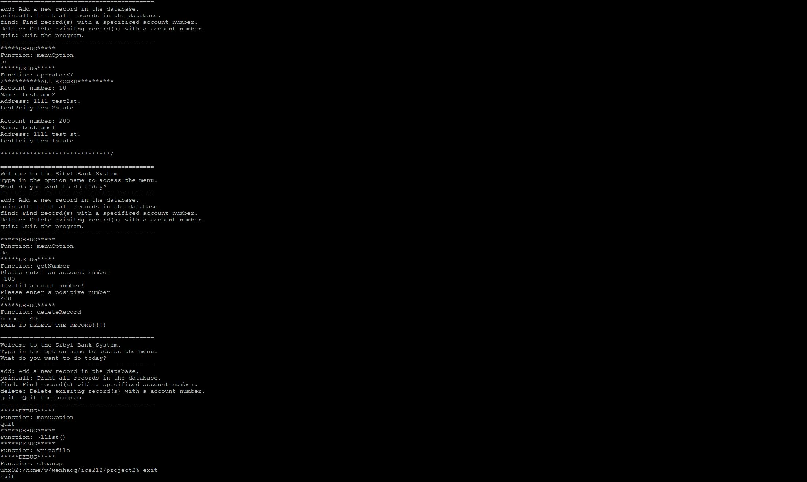

 
 
This project is a bank database program that I made for ICS 212. The user can interact with the program by typing the choices in the console. This bank database allows the user to add records, print a list of records, find a specific record, delete a specific record, load any list of records at the beginning of the program, and save any list of records when the user exit the program. The database is run on the heap memory so it’s dynamic. This also created a lot of challenges because I have to be more careful with pointers and memory. This project taught me how to code in C++, how to use pointers, how memory allocation works in C++, reference and polymorphism.
 
 ## Example of the program running
 
 
This project can be found <a href="https://github.com/wenhaoq20/bank-system">here</a>
